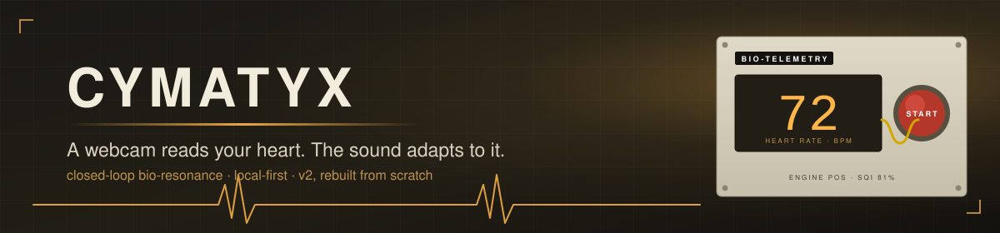
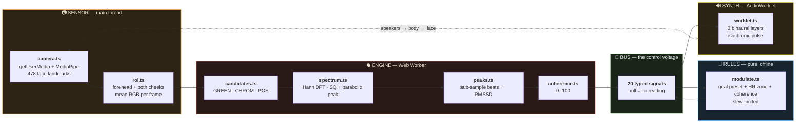

<div align="center">
  
</div>

<div align="center">

# ♥ Cymatyx

**A closed-loop bio-resonance instrument.**
A webcam reads your pulse off your face (rPPG), the engine turns it into **heart rate, HRV and coherence**,
and the binaural/isochronic audio **adapts to what it measures** — every other entrainment app is open-loop.
No biometrics leave the machine.

<br/>


**[Design spec →](docs/superpowers/specs/2026-09-04-cymatyx-v2-design.md)** · **[M1 plan →](docs/superpowers/plans/2026-09-04-cymatyx-v2-m1-plan.md)** · **[Product truth →](PRODUCT.md)** · **[Run it →](#-run-it)**

</div>

---

> [!NOTE]
> **This is an instrument, not a wellness product.** It reports what it measured and adapts sound to it.
> Binaural beats are real acoustics; the frequency-following claims behind entrainment are *mixed* evidence
> (modest for anxiety/attention); the big claims are unsupported. Cymatyx makes no medical claims and
> shows no number it did not measure — a missing reading renders as `--`, never as `0`.
>
> **v2 is a rewrite, not a port.** v1 died of a settings maze (2×2 audio pages, a coach buried two tabs deep,
> a voice mode that only spoke Gemini, an invisible camera). It is archived at `rustyorb/Cymatyx-v1-archived`.
> Knowledge carried forward; code did not.

## 🧭 The loop

> ### The loop *is* the architecture.<br/>Sensor → engine → bus ← rules → synth → speakers → body → sensor.

Everything in the app is one signal path, modeled literally. The spine is a **control-voltage bus**: a
single typed store of named signals (`bpm`, `hrv_rmssd`, `coherence`, `sqi`, `beat_hz`, `carrier_hz`,
`breath_phase`, `cam_live`, `session_state` …), each stamped when written, each `null` until something
real produced it. **UI components only render bus signals** — the typed hook is the one sanctioned way to
read a value, and the instrument tests pin the `--` behaviour, so the honesty rule is a convention the
types and tests enforce rather than a code-review hope.



## 🫀 The engine

Remote photoplethysmography at 30 fps off a consumer webcam, ported from the papers and checked against
an Apache-2.0 reference implementation (QualityPhys/CRVSE), reviewed adversarially before the rewrite, and
reviewed twice more after it — once by a Claude reviewer, once by GPT-6 Astra, independently, both with
in-memory probes rather than opinions. What the reviews changed is in the table.

| | the hard part | what the engine does about it |
|:--:|---|---|
| **1** | **Illumination drift swamps the pulse.** Green-channel amplitude is ~0.4 % of the mean; a lamp flicker or a head turn is 5 %. | Three candidate projections per frame — **GREEN** (raw), **CHROM** (de Haan & Jeanne 2013), **POS** (Wang et al. 2016). CHROM/POS cancel multiplicative common-mode drift; the synthetic tests prove GREEN's peak gets captured by drift while POS/CHROM stay on the pulse. |
| **2** | **Which candidate to trust.** | Each gets a spectral **SQI** — power within one native FFT bin of the peak over total in-band power (the reviewer caught v1 measuring ±1 BPM instead of ±1 bin, which made the scores incomparable). **AUTO** keeps the incumbent method unless a rival beats it by 15 %, so it does not flap. |
| **3** | **One patch of skin is not enough.** | **Three ROIs** (forehead + both cheeks) from MediaPipe landmarks. Each ROI gets its own SQI; ROIs below half the best are dropped; the rest are fused SQI-weighted. A cheek covered by a hand does not wreck the estimate (tested). |
| **4** | **Webcams do not deliver 30 fps.** | The engine measures fps **from the timestamps in its window** rather than trusting the caller. ±5 ms jitter and 5 % dropped frames stay within 1 BPM (tested). |
| **5** | **1 BPM resolution from an 8 s window.** | Hann-windowed DFT scanned at 1-BPM steps over 45–180, then **parabolic refinement on log-power** for sub-BPM peaks. |
| **6** | **HRV from 30 fps is quantized to ±33 ms** — larger than the RMSSD being measured. | Beats are located to **sub-sample precision** (parabola through the three samples around each maximum) and timestamps interpolated. The first run of the suite caught exactly this: "regular" synthetic beats came back with 29 ms of RMSSD that was pure sampling artifact. |
| **7** | **Lucky noise looks like a weak pulse.** Measured: pure sensor noise can score SQI 0.6 and peak prominence 7 on a single frame — a weak real pulse scores 0.45 and 5. | Single-frame quality cannot tell them apart, so the engine gates on **physics instead**: a real pulse shows the **same frequency in all three ROIs** (noise disagrees) and **holds for 2 s** (noise wandered 15–110 BPM in the measurement). SQI floor + prominence floor + ROI agreement + temporal lock; all eight noise seeds end with no BPM, every real-pulse case still reads. |
| **8** | **"Coherence" is easy to fake.** The first metric (CV + autocorrelation of an RMSSD history) scored white noise at 64–70 and metronomic beats at 5 — a reviewer measured it. | Replaced by the **spectral tachogram** definition: a continuous **beat tracker** keeps one identity per beat across overlapping windows; the RR series is resampled to 4 Hz and the share of power within one bin of the dominant 0.03–0.4 Hz peak is the score. Measured: resonant 0.1 Hz breathing 98–100, white-noise RR 26–43. Needs 15 beats over 20 s; `--` before that. |
| **9** | **Never a spurious number.** | `null` until 3 s of samples; a 1 s hole in the stream (face lost, tab hidden) restarts the window; a session with no readings records nulls, not zeros; too few calibration readings → RSA baseline `--`. |

The whole engine is pure TypeScript with no DOM dependency, so it runs in a **Web Worker** and every
piece has synthetic-signal tests with stated tolerances (the sub-BPM, drift, jitter, multi-ROI and SQI
cases above are all in `tests/engine/`).

## 📐 The rules

The only modulator in M1 is an **offline rule engine** — no model, no cloud. A goal preset
(RELAXATION 7.83 Hz · FOCUS 14 Hz · ENERGY 18 Hz beat) is adjusted by the HR zone (high HR under
RELAXATION → slower beat and slower breath; low HR under ENERGY → push the beat up) and by coherence
(rising coherence deepens the isochronic pulse a little, capped). Every parameter is **slew-limited**
per 500 ms tick, so the sound *adapts* rather than lurches. The rules are a pure function and are
table-tested, including a 100-tick convergence check.

## 🔊 The synth

An **AudioWorklet** renders three harmonic binaural layers (left = carrier·k, right = (carrier + beat)·k,
k ∈ {1, 1.5, 2}) under an isochronic amplitude pulse at the beat rate. Parameters glide per audio block
so a bus patch never clicks. START is the user gesture that unlocks audio, so the synth starts before the
camera; the smoke test checks the analyser is actually producing samples.

## 🎛 The rack

The face is the **Silver Rack**: cream lab-instrument modules with screw heads, tape labels, nixie-amber
readouts behind glass, a cream-faced coherence VU, backlit round goal latches and a red mushroom START.
Rules inherited from the product: **never cyan**, and **honest skeuomorphism** — every lamp and needle is
wired to a bus signal, and there is no imaginary hardware (no "brain mapping" panel; there is no EEG).

- **Bio-Telemetry** — nixie tubes for BPM and HRV, engine method + SQI, live pulse trace.
- **Session Controller** — goal latches, paced-breath ring (its phase is a bus signal), START/STOP, state.
- **HRV Coherence** — the VU (needle honestly at rest when there is no reading), the **Subject monitor**
  with a red tally lamp: the camera is never invisible while it samples.
- **Patch bay** (back of the rack, M1 minimal) — the live rules→synth patch (beat, carrier, pulse depth,
  master, breath), rPPG method select, camera input select, engine confidence.

## 🗓 Sessions

`idle → warming → calibrating → active → summary`. Warming ends at the first real BPM. Calibration is 30 s
of guided breathing; the RSA baseline is the HR swing over that window. Only readings taken while `active`
enter the record (averages, peak coherence, sample count, series), persisted locally with Dexie.
A camera denial is shown on the rack in red and returns the machine to idle — it never fakes a session.

## 📏 Numbers

| | |
|---|---|
| source modules | 34 files · 1,942 lines |
| bus signals | 20, all nullable measurements or explicit state |
| rPPG methods · ROIs | 3 (+ AUTO) · 3 |
| engine window | ~8 s · first reading after ~3 s |
| unit tests | 80 across bus / engine / sensor / rules / synth / session / UI |
| end-to-end | 1 Playwright smoke with a fake camera: boots honest → START → camera live, state leaves idle, patch bay populated, audio non-zero → STOP → idle |

## 🧰 Run it

```bash
npm install
npm run dev        # http://localhost:3000
npm test           # vitest, 80 tests
npm run test:e2e   # playwright (npx playwright install chromium first)
npm run build      # tsc --noEmit && vite build
```

Chrome/Edge recommended (MediaPipe GPU delegate, AudioWorklet). The face-landmark model (~4 MB) is
fetched from Google's model CDN on first START; the camera pixels never leave the page.

> [!WARNING]
> **What M1 is not, yet.** No coach voice, no 40 Hz gamma, no history charts, no PWA, no cloud
> providers — by design (see milestones in the spec). The coherence score is the spectral-tachogram
> ratio described above, computed from camera-detected beats — the same *shape* as the published
> definitions, not a validated clinical metric. Every quality gate (SQI floor, prominence, ROI agreement,
> 2 s lock) and every slew value was set on synthetic signals; **no real face has been measured yet** —
> they will move. Beat detection is pulse-wave maxima from a camera, not ECG R-peaks — RMSSD here is a
> *camera* RMSSD. POS/CHROM run one projection over the whole 8 s window rather than the papers'
> short-window overlap-add, and there is no chrominance bandpass before CHROM's alpha; motion robustness
> is unvalidated (flagged by review, deferred until there is a face to tune on).

## 🗺 Roadmap

| milestone | what works end-to-end | status |
|---|---|---|
| **M1 — the pure loop** | camera → rPPG → HR/HRV/coherence → rules → adaptive audio + breathing guide, one rack, session saved locally | **shipped** (this) |
| **M2 — the coach** | spoken lines from a local LLM (or fixed lines) through one local TTS jack (Kokoro proven; OmniVoice via shim); tone reacts to coherence | next |
| **M3 — 40 Hz gamma** | click train + flicker behind a blocking photosensitive-epilepsy gate; audio-only alternative | later |
| later | history/trends, rack flip (full back-of-rack patch view), local STT, Elata bio-sdk eval, cymatyx.com | |

## 🗂 Layout

```
Cymatyx/
├── src/
│   ├── bus/            the control voltage -- 20 typed signals, stamped, null until real
│   ├── engine/         pure rPPG math -- candidates, spectrum+SQI, peaks→RMSSD, coherence, worker
│   ├── sensor/         camera + MediaPipe landmarks → three ROIs of mean RGB
│   ├── rules/          goal presets + the offline modulator (slew-limited, pure)
│   ├── synth/          AudioWorklet (3 binaural layers + isochronic pulse) and its node graph
│   ├── session/        state machine, Dexie persistence, the orchestrator that wires the loop
│   └── ui/             the Silver Rack -- instruments (nixie, VU, tally, latches, mushroom) + rack front/back
├── tests/              mirrors src -- synthetic-signal engine tests with stated tolerances
├── e2e/                Playwright smoke with a fake camera device
├── docs/superpowers/   the v2 design spec and the M1 implementation plan
└── PRODUCT.md          product truth carried forward from v1: local-first, honest claims, never cyan
```

---

<div align="center">

*The loop is the architecture. A reading the instrument did not take is a dash, not a zero.*

**[📐 Design spec](docs/superpowers/specs/2026-09-04-cymatyx-v2-design.md)** · **[🧪 Engine tests](tests/engine/)** · **[📓 Product truth](PRODUCT.md)**

</div>
